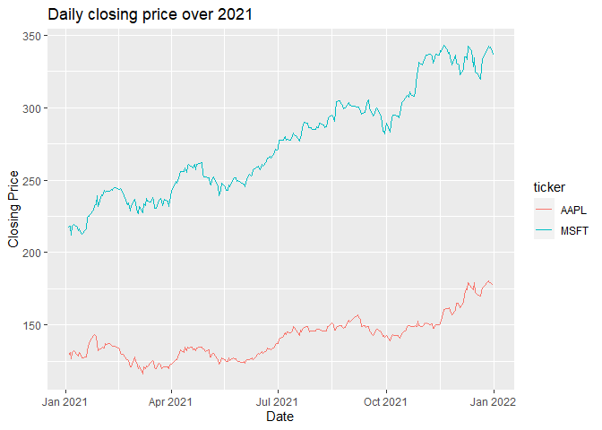
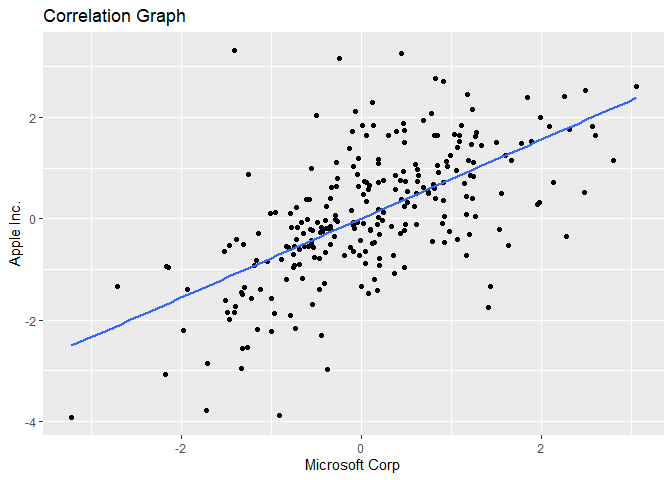
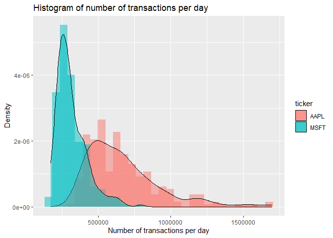
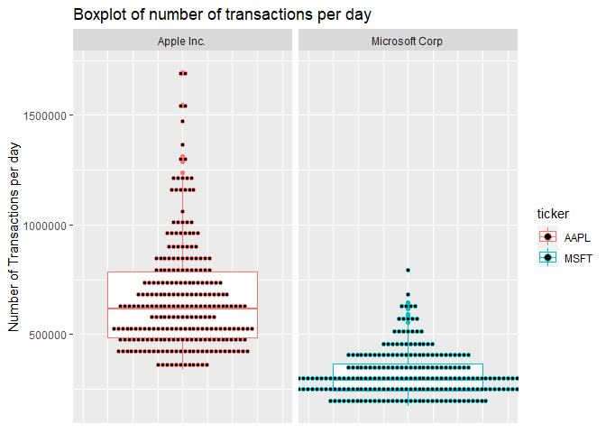
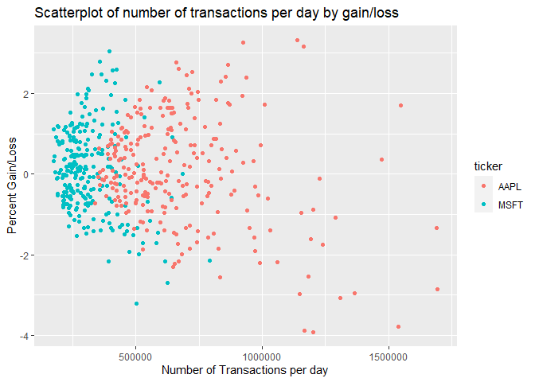

financial-api-vignette
================

-   [1 Financial API and Exploratory Data
    Analysis](#financial-api-and-exploratory-data-analysis)
-   [2 Requirements](#requirements)
-   [3 API Interaction Functions](#api-interaction-functions)
    -   [3.1 Helper Functions](#helper-functions)
        -   [3.1.1 `getFromJSON`](#getfromjson)
        -   [3.1.2 `getTickerTypes`](#gettickertypes)
        -   [3.1.3 `getTickers`](#gettickers)
        -   [3.1.4 `getTickerName`](#gettickername)
    -   [3.2 Main Function](#main-function)
        -   [3.2.1 `getAggregates`](#getaggregates)
    -   [3.3 Exploratory Data Analysis](#exploratory-data-analysis)
        -   [3.3.1 Closing price in 2021](#closing-price-in-2021)
        -   [3.3.2 Gain correlation](#gain-correlation)
        -   [3.3.3 Looking at gains
            categorically.](#looking-at-gains-categorically)
        -   [3.3.4 Histogram and boxplot of the number of transactions
            per
            day](#histogram-and-boxplot-of-the-number-of-transactions-per-day)
        -   [3.3.5 Relationship between big gain/loss and the number of
            transactions](#relationship-between-big-gainloss-and-the-number-of-transactions)

# 1 Financial API and Exploratory Data Analysis

The following serves as a vignette to show one possible way to access
the Financial API on `polygon.io`.

# 2 Requirements

The following libraries are required to use the Financial API

-   `tidyverse`: Many useful functions.
-   `httr`: To get the information from the polygon API
-   `jsonlite`: Convert JSON into usable data
-   `memoise`: To prevent repeated calls to the API for the same
    information
-   `ratelimitr`: Limits the query rate to the API below the required 5
    per minute
-   `lubridate`: For easier handling of date/time.

# 3 API Interaction Functions

## 3.1 Helper Functions

### 3.1.1 `getFromJSON`

Utilizes `GET` and `fromJSON` to retrieve a JSON type object and convert
it into something usable. Uses `memoise` to prevent repeated queries to
the API for the same information.

``` r
# Limit the rate at which the GET function can be called due to API limits
limGET <- limit_rate(GET, rate(n = 5, period = 60))

getFromJSON_fun <- function(URL = "https://api.polygon.io", path, query = list()) {
  # Create query list
  query$apiKey = apiKey
  
  # Get the results from the server
  results <- limGET(URL, path = path, query = query)

  # Convert from a JSON
  content <- rawToChar(results$content) %>% 
    fromJSON()
  
  # Continue getting information until finished
  while(exists("next_url", content)) {
    results <- limGET(content$next_url, query = query)

    new_content <- rawToChar(results$content) %>%
      fromJSON()

    append(content, new_content)
  }
  
  return(content)
}
getFromJSON <- memoise(getFromJSON_fun)
```

### 3.1.2 `getTickerTypes`

This function gets the proper ticker type values to use in queries.
Functionality from `memoise` package is used here so that information
only need to be looked up once.

``` r
# Helper function to build the URL
getTickerTypes_fun <- function() {
  # Retrieve JSON from the api 
  content <- getFromJSON(path = "/v3/reference/tickers/types")
  
  # Create lookup table
  output <- tolower(content$results$description)
  names(output) <- tolower(content$results$code)
  
  # Return the output
  return(output)
}
getTickerTypes <- memoise(getTickerTypes_fun)
```

### 3.1.3 `getTickers`

This function returns the proper ticker based on the search parameter
and the type of ticker. Could be expanded with other optional parameters
of the Tickers Reference Data Endpoint.

``` r
# Helper function to query$search for symbol
getTickers <- function(search, type = "", 
                       market = c("", "stocks", "crypto", "fx", "otc")) {
  # Storage for options to be passed to the API
  query <- list(search = search)
  query$market <- match.arg(market)
  
  # Check if valid optional parameters were entered
  # Currently supported: type
  
  # type should match one of the types in getTickerTypes
  if (type != "") {
    # Get the valid ticker types
    types <- getTickerTypes()
    
    # Check if the type is an code or a description
    if (type %in% names(types)) {
      # type is already a code
      query$type <- type
    } 
    else {
      # Check if type is a description
      if (type %in% types) {
        # use look up table to get correct code form description
        query$type <- types[type]
      }
      else {
        # type is neither a code or a description so throw an error
        stop(paste0(type, " is not a valid type"))
      }
    }
  }

  # Retrieve the information on the ticker(s)
  content <- getFromJSON(path = "/v3/reference/tickers",
                             query = query)
  
  # Check for zero or multiple results
  if (is_empty(content$results)) {
    message <- paste0("No tickers mateched \"", query$search, "\"")
    stop(message)
  } 
  else if (length(content$results$ticker) > 1) {
    # Check for an exact match to a ticker, case insensitive
    if (tolower(content$results$ticker) == tolower(query$search)) {
      return(content$results$ticker)
    } 
    else {
      message <- paste0("Multiple tickers matched \"", 
                      query$search, "\":\n", toString(content$results$ticker),
                      "\n", toString(content$results$name))
      stop(message)
    }
  }
  else {
    return(content$results$ticker)
  }
}
```

### 3.1.4 `getTickerName`

This function returns the name of a particular ticker.

``` r
getTickerName <- function(search, ...) {
  # Retrieve the proper ticker for the search query
  ticker <- getTickers(search, ...)
  
  # Retrieve the detailed information on the ticker
  output <- getFromJSON(path = paste0("/v3/reference/tickers/", ticker))
  
  unlist(output$results[[2]])
}
```

## 3.2 Main Function

### 3.2.1 `getAggregates`

Takes a particular ticker retrieves the pricing information for the date
span specified. Dates should be formatted `YYYY-MM-DD`

``` r
getAggregates <- function(search, multiplier = 1, 
                          timespan = c("day", "week", 
                                       "month", "quarter", "year"),
                          from, to, ...) {
  # Storage for options to be passed to the API
  timespan <- match.arg(timespan)
  
  # Retrieve the proper ticker for the search query
  ticker <- getTickers(search, ...)
  
  path = paste("/v2/aggs/ticker",
                               ticker, "range", multiplier, timespan, 
                               from, to,
                               sep = "/")
  
  # Retrieve the aggregates information on the ticker
  output <- getFromJSON(path = paste("/v2/aggs/ticker",
                               ticker, "range", multiplier, timespan, 
                               from, to,
                               sep = "/")) %>% 
    as_tibble() %>% 
    select(ticker, results) %>% 
    unnest(results)
  
  # Convert timestamp into a date
  output$t <- as_datetime(output$t/1000) %>% as_date()
  
  return(output)
}
```

## 3.3 Exploratory Data Analysis

Let’s compare Microsoft to Apple.

``` r
# Microsoft and Apple
msft <- getAggregates("msft", from = "2021-01-01", to = "2021-12-31") %>%
  add_column(name = getTickerName("msft"))
apple <- getAggregates("aapl", from = "2021-01-01", to = "2021-12-31") %>%
  add_column(name = getTickerName("aapl"))

# Combine data frames and add new variable
year <- bind_rows(msft, apple) 

# Create a gain variable to show the percentage change from open to close each day.
year <- mutate(year, gain = (c / o)*100-100)

year %>%
  group_by(ticker) %>%
  summarize(c = quantile(c), trn = quantile(n)) %>%
  add_column(quantile = rep(c("Min", "25p", "Med", "75p", "Max"), 2)) %>%
  pivot_wider(names_from = quantile, values_from = c(c, trn))
```

    ## # A tibble: 2 x 11
    ## # Groups:   ticker [2]
    ##   ticker c_Min c_25p c_Med c_75p c_Max trn_Min trn_25p trn_Med trn_75p trn_Max
    ##   <chr>  <dbl> <dbl> <dbl> <dbl> <dbl>   <dbl>   <dbl>   <dbl>   <dbl>   <dbl>
    ## 1 AAPL    116.  129.  141.  149.  180.  338584 483503. 615854. 783922. 1695154
    ## 2 MSFT    212.  244.  277.  302.  343.  174282 243592. 293082  366742.  793734

### 3.3.1 Closing price in 2021

First, lets look at their price history over the year 2021.

``` r
g <- ggplot(year)

g + aes(x = t, y = c, color = ticker) + 
  geom_line() +
  labs(title = "Daily closing price over 2021",
       x = "Date", y = "Closing Price")
```

<!-- -->

Their trend lines look quite similar, leading us to believe that they
are correlated.

### 3.3.2 Gain correlation

Lets create a gain variable so we can see the percentage gain or loss
from each day. Then we will plot the gains and losses against the other
to visualize any correlation.

``` r
gain_wider <- year %>% select(name, gain) %>%
  pivot_wider(names_from = name, values_from = gain) %>%
  unnest()

ggplot(gain_wider, aes(x = `Microsoft Corp`, y = `Apple Inc.`)) + 
  geom_point() +
  geom_smooth(method=lm, se=FALSE) + 
  labs(title = "Correlation Graph")
```

<!-- -->

``` r
correlation <- round(cor(gain_wider["Microsoft Corp"], gain_wider["Apple Inc."])*100, 0)
```

As we can see, the two are positively correlated with 63% correlation.

### 3.3.3 Looking at gains categorically.

Next, lets take a look at the breakdown of large and small losses/gains.
The breakpoints are -1.5, 0 and 1.5.

``` r
year <- year %>% mutate(gain_size = cut(gain, 
                                           breaks = c(-Inf, -1.5, 0, 1.5, Inf),
                                           labels = c("BigLoss", "SmallLoss", 
                                                      "SmallGain", "BigGain")))
table(year$gain_size, year$name)
```

    ##            
    ##             Apple Inc. Microsoft Corp
    ##   BigLoss           26             11
    ##   SmallLoss        100            106
    ##   SmallGain         86            113
    ##   BigGain           40             22

### 3.3.4 Histogram and boxplot of the number of transactions per day

Next, lets move our attention over to the number of transactions made
per day on each of these stocks. First a histogram:

``` r
g + aes(x = n, y = ..density.., fill = ticker) + 
  geom_histogram(position = "identity", alpha = 0.5) +
  geom_density(alpha = 0.5) +
  labs(title = "Histogram of number of transactions per day",
       x = "Number of transactions per day", y = "Density")
```

<!-- -->

And then a boxplot:

``` r
g + aes(x = n, color = ticker) + 
  coord_flip() +
  geom_boxplot() +
  geom_dotplot(stackdir = "center", dotsize = 0.4) +
  facet_grid(~name) +
  labs(title = "Boxplot of number of transactions per day",
       x = "Number of Transactions per day", y = "") +
  theme(axis.title.x=element_blank(),
        axis.text.x=element_blank(),
        axis.ticks.x=element_blank())
```

<!-- -->

Both are right skewed but Apple is much more heavily tailed than
Microsoft, and has a higher mean number of transactions.

### 3.3.5 Relationship between big gain/loss and the number of transactions

Finally, lets see if there’s a relationship between the big gain/loss,
which Apple had more of, and the number of transactions, which Apple
also had more of

``` r
g + aes(x = n, y = gain, color = ticker) +
  geom_point() +
  labs(title = "Scatterplot of number of transactions per day by gain/loss",
       x = "Number of Transactions per day", y = "Percent Gain/Loss")
```

<!-- -->

From here, it is pretty clear that a lower number of transactions of a
particular stock equates to lower volatility of that particular stock.
However, the two stocks have different stocks have different points for
the low values.
